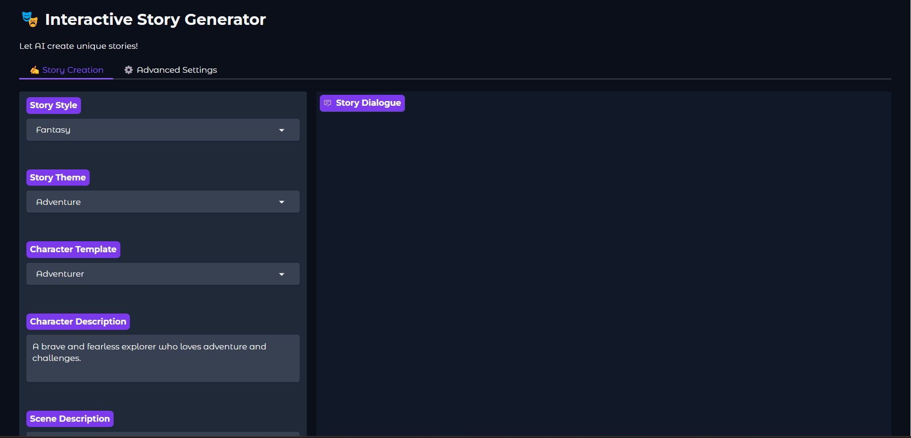
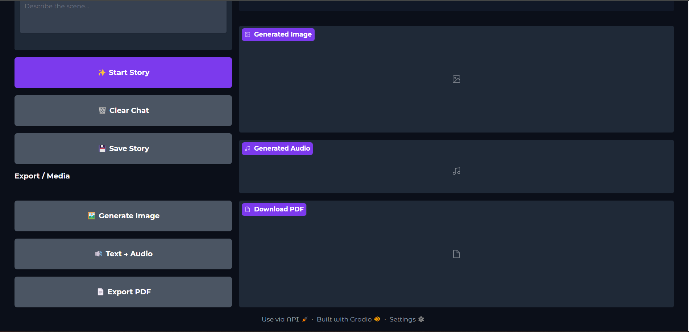

🎭 Interactive AI Story Generator

An AI-powered multi-modal storytelling application that lets you create immersive stories with real-time text generation, vivid illustrations, voice narration, and downloadable storybooks — all powered by Hugging Face, Gradio, and Python.

🚀 Live Demo

(Replace the link above with your actual Hugging Face Space URL.)

🧠 Features
Category	                        Description
📝 Story Generation	               Generates coherent, creative stories using Mixtral-8x7B-Instruct on Hugging Face.
🎨 AI Image Generation	           Creates scene illustrations via Stable Diffusion (customizable model).
🔊 Text-to-Speech (TTS)	           Converts generated stories into natural voice narration using gTTS.
📄 Export to PDF	               Compiles your story (with image) into a downloadable e-book format.
💾 Save Stories	                   Automatically saves your story sessions locally.
🧩 Gradio Interface	               Interactive, clean, and ready to deploy on Hugging Face Spaces.

🧰 Tech Stack

Python 3.13

Gradio – for UI and interaction

Hugging Face Inference API – for text and image generation

gTTS – for voice narration

FPDF – for storybook export

dotenv – for secure token management

Requests & Logging – for robust API handling

🌈 Usage Guide

1. Select story style, theme, and character.

2. Describe a scene and click “✨ Start Story”.

3. The AI will generate the first chapter and continue as you interact.

4. Use the sidebar tools to:

   🖼️ Generate an image for the current scene

   🔊 Convert the story to audio
 
   📄 Export the story as a PDF book

   💾 Save the chat
   
🔐 Environment Variables

Variable	               Description
HF_TOKEN	               Fine-grained Hugging Face access token (required for API calls)
HF_IMAGE_MODEL	           Optional: override image model (default: stabilityai/stable-diffusion-2)

✨ Example Screenshots

🧩 Future Enhancements

🌃 Neon cyberpunk UI with animated transitions

💬 Typing effect for story text

🧠 Memory-based story continuity across sessions

🌐 Multi-language voice narration support